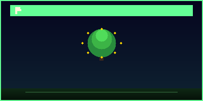

# RQBBOX GAME STUDIOS / RHYSTECH INTERACTIVE



## PLAYTREE — Chapter 0 : Season 0

A stylized multiplayer fantasy adventure game built with Python and Pygame.

### Features

- **5 Playable Classes** — Guardian, Ranger, Mage, Mechanic, Beast Tamer
- **4 Story Rounds** — Unique bosses and narrative progression
- **Daily Login Rewards** — 5-day streak system
- **Local Leaderboards** — 6 competitive categories
- **Skill Tree System** — 5 skills per class with branching paths
- **Equipment & Armor** — 4 gear slots with rarity tiers
- **Enchanting Table** — Weapon and armor upgrades
- **Fishing Minigame** — 5 fish rarities from Common to Legendary
- **Pet Taming & Evolution** — 5 creatures with multi-stage evolutions
- **Base Building** — 6 structure types
- **Weather System** — Rain, snow, fog, and storms
- **Mount System** — Forest Stag, Crystal Wolf, Shadow Raven, Sky Drake, Ancient Beetle
- **New Game+** — Replay with scaled difficulty after Round 4
- **Interactive Tutorial** — 11-step guided onboarding
- **USB Auto-Launch** — Portable USB drive support
- **TV Controller Support** — Xbox, EKO HOME, Google TV, Android TV, Apple TV
- **Multiplayer Lobby** — Local network play
- **Screenshot Capture** — Press F12
- **RHYSTECH Account System** — Local user profiles
- **Background Music & SFX** — Procedural audio engine

### Platforms

| Platform | Status |
|----------|--------|
| Windows (.exe) | ✅ Released |
| Android (.apk) | 🔨 Building |
| Linux | 📋 Planned |

### Quick Start

#### Windows
1. Download `PLAYTREE.exe` from [Releases](../../releases)
2. Double-click to play

#### Android
1. Download `PLAYTREE.apk` from [Releases](../../releases)
2. Enable "Install from unknown sources"
3. Install and play

### Build from Source

#### Windows (.exe)
```bash
cd playtree
pip install pyinstaller pygame-ce
python -m PyInstaller --name PLAYTREE --onefile --windowed --add-data "src;src" --hidden-import pygame main.py
```

#### Android (.apk)
```bash
cd playtree
pip install buildozer
buildozer android debug
```

### Controls

| Action | Keyboard | Controller |
|--------|----------|------------|
| Move | WASD / Arrows | Left Stick |
| Attack | Left Click | A |
| Dodge | Space | B |
| Special | Q / 3 | Y |
| Inventory | I | X |
| Crafting | C | RB |
| Mount | M | LT |
| Storm | T | — |
| Screenshot | F12 | — |
| Pause | Escape | Start |

### Project Structure

```
rtech-rqbbox-os/
├── playtree/              # Main game source
│   ├── main.py            # Entry point
│   ├── config.py          # Game configuration
│   ├── build_exe.py       # Windows build script
│   ├── buildozer.spec     # Android build config
│   ├── src/               # Game modules
│   │   ├── game.py        # Core game loop
│   │   ├── player.py      # Player system
│   │   ├── world.py       # World generation
│   │   ├── enemies_expanded.py
│   │   ├── boss.py        # Boss system
│   │   ├── menu.py        # Main menu
│   │   ├── audio.py       # Procedural audio
│   │   └── ...            # 30+ game modules
│   └── dist/              # Built executables
├── chrome_ext/            # Chrome extension
├── usb_setup/             # USB auto-launch setup
├── website/               # Official website
└── assets/                # Banners, logos, icons
```

### Version

- **Current:** v1.0.0 — Chapter 0 : Season 0
- **Engine:** Python 3.14 + Pygame CE 2.5.7

### Credits

- **Developer:** RQBBOX GAME STUDIOS / RHYSTECH INTERACTIVE
- **Year:** 2026

---

*Awaken. Rebuild. Restore Balance.*
